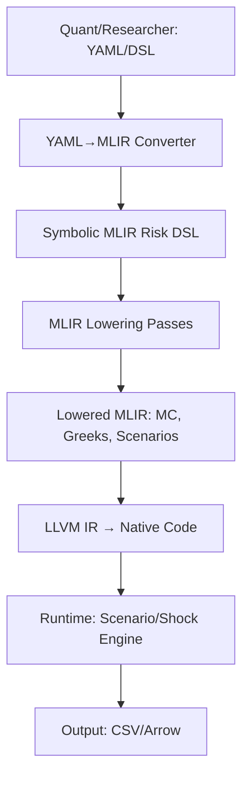

# Pryce: Quantitative Finance Compiler & MLIR Dialect

**Pryce** is a cutting-edge, open-source compiler infrastructure for quantitative finance, derivatives pricing, and risk analytics. Built atop LLVM/MLIR, Pryce empowers quants, HFT engineers, and researchers to express, simulate, and risk financial contracts in a symbolic, human-readable DSL—then compiles them to lightning-fast native code.

---

## Why Pryce?
- **Expressive DSL:** Write contracts, payoffs, and risk logic in a symbolic, readable form.
- **Compiler-Grade Speed:** Leverage MLIR/LLVM for high-performance Monte Carlo, scenario, and adjoint risk analytics.
- **Research to Production:** Go from prototype to HFT-grade execution in one pipeline.
- **Extensible:** Easily add new financial instruments, risk hooks, or analytics.
- **Transparency:** Symbolic-to-executable workflow, golden outputs, and full test coverage.

---

## Project Architecture



---

## Features
- **Custom MLIR Dialect:** `simulate_gbm`, `payoff_call`, `payoff_digital_call`, `discount`, and more.
- **Automatic Differentiation:** Symbolic adjoint/Enzyme integration for Greeks (Delta, Gamma, Vega).
- **Scenario & Stress Testing:** Scenario grid, shocks, and full risk analytics.
- **Symbolic Contract DSL:** Human-readable contract/risk logic, YAML→MLIR conversion.
- **Golden Outputs & Fuzzing:** Regression, fuzz, and property-based tests for reliability.
- **Professional Examples:** Each feature is showcased in a dedicated, reproducible example folder.

---

## Quickstart & Build

1. **Clone & Setup:**
   ```bash
   git clone <your-fork-or-upstream>
   cd pryce
   ./scripts/setup_env.sh
   ```
2. **Build:**
   ```bash
   mkdir build && cd build
   cmake .. && make -j
   ```
3. **Run an Example:**
   ```bash
   cd examples/european_call
   bash run_pipeline.sh
   python3 black_scholes.py
   ```

For full details, see `steps.md` and each example's README.

---

## Advanced Example Gallery

### 1️. European Call Option (examples/european_call/)
- **What:** Monte Carlo pricing of a vanilla European call option.
- **How:** Symbolic MLIR input (`call_option.mlir`) simulates GBM, computes call payoff, averages, discounts.
- **Compare:** Python script (`black_scholes.py`) for analytical price; pipeline script for MC output.
- **Why it matters:** Classic quant test, demonstrates correctness and speed.

### 2️. Digital (Binary) Option (examples/digital_option/)
- **What:** Pricing a digital (binary) option with non-linear payoff.
- **How:** Custom op `payoff_digital_call` in MLIR; scenario grid and MC simulation.
- **Compare:** Analytical Black-Scholes digital price in Python.
- **Why it matters:** Shows extensibility and ability to handle exotic payoffs and conditional logic.

### 3. Autodiff Greeks (examples/autodiff_greeks/)
- **What:** Automatic differentiation (adjoint/Enzyme) for Greeks (Delta, Gamma) of a call option.
- **How:** Symbolic pricing logic differentiated wrt spot; both price and sensitivities compiled and executed natively.
- **Compare:** Python script for analytical Greeks.
- **Why it matters:** Demonstrates compiler IR transformation, risk sensitivity, and numerical stability.

### 4. Symbolic Risk Engine (examples/symbolic_risk/)
- **What:** Portfolio-defining symbolic risk DSL: contracts, risk hooks, scenarios, and adjoint analytics in one pipeline.
- **How:**
    - Write contract/risk logic in YAML or symbolic MLIR
    - Convert with `yaml_to_mlir.py`
    - Lower, compile, and run scenario grid with `run_pipeline.sh`
    - Output: scenario P&L, Delta, Gamma, Vega, shocked results
- **Why it matters:** This is the infrastructure used by top HFT/quant firms for large-scale scenario and risk management.

---

## Directory Structure (Highlights)

- `mlir/include/DerivLab/` — TableGen dialect and ops
- `mlir/lib/` — C++ dialect/lowering/transform passes
- `runtime/` — C++ runtime helpers (MC, Black-Scholes, scenario engine)
- `examples/` — Advanced, reproducible example folders
- `scripts/` — Helper scripts for pipeline, regression, fuzz, and benchmarking
- `test/` — Unit, integration, regression, and fuzz tests
- `docs/` — Architecture, usage, and design documentation

---

## Documentation & Community
- See each example's `README.md` for details.
- `docs/architecture.md` for in-depth design.
- Contributions, issues, and feature requests welcome!

---

## About Pryce
Pryce is designed for clarity, extensibility, and performance. Whether you’re a quant researcher, HFT engineer, or academic, Pryce lets you:
- Prototype new contracts and risk logic
- Validate and benchmark MC vs analytical results
- Run scenario and adjoint risk analytics at scale
- Build the next generation of quant finance infrastructure

---

**ready to price, risk, and innovate? welcome to Pryce.**

<p align="center"><i>built with excessive amounts of caffeine by aditi ramakrishnan</i></p>
